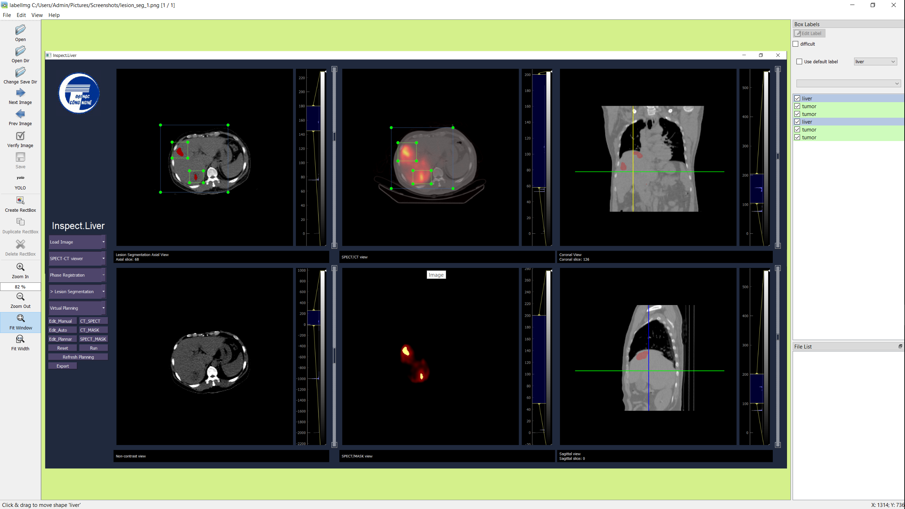
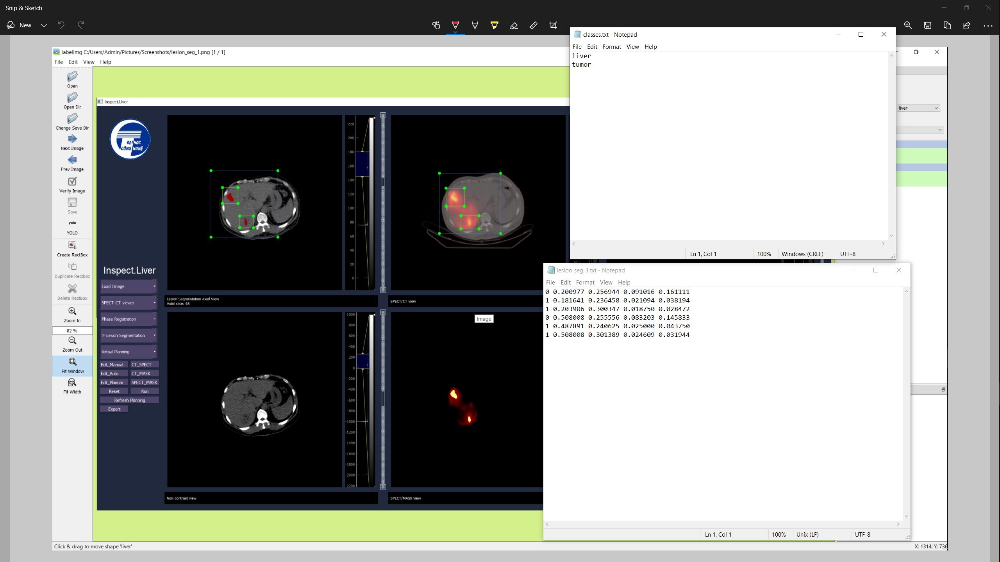

# OD_LabelTool
This is the .exe version of [LabelImg](https://github.com/tzutalin/labelImg#build-from-source) object detection label tool. Following is the introduction taken from the official github of [LabelImg](https://github.com/tzutalin/labelImg#build-from-source). For more information, you can visit the official github for further details. <br>

LabelImg is a graphical image annotation tool. It is written in Python and uses Qt for its graphical interface. Annotations are saved as XML files in PASCAL VOC format, the format used by ImageNet. Besides, it also supports YOLO and CreateML formats.

[](demo/img1.png)
[](demo/img2.png)
  
## Installation and run
1. Download the github by:
``` bash
git clone https://github.com/LocPham263/OD_LabelTool.git
cd OD_LabelTool
```
2. Create pre-defined classes <br>
Locate to `./dist/LabelImg/data/` and modify the `predefined_classes.txt` file to define classes you want <br>
**Note** that the label list should not be changed in the middle of processing a list of images

3. Run the application <br>
Locate to `./dist/LabelImg/LabelImg.exe` and click to run the application.

4. Demo video <br>
You can watch a demo video [here](https://www.youtube.com/watch?v=p0nR2YsCY_U)

# Useful Hotkey while using the tool: 
|Hotkeys  | Meaning |
|---------|----------------------------------------|
|Ctrl + u | Load all of the images from a directory|
|Ctrl + r | Change the default annotation target dir|
|Ctrl + s | Save |
|Ctrl + d | Copy the current label and rect box|
|Ctrl + Shift + d | Delete the current image|
|Space    | Flag the current image as verified|
|w        | Create a rect box |
|d        | Next image |
|a        | Previous image |
|del      | Delete the selected rect box|
|Ctrl++   | Zoom in |
|Ctrl--   | Zoom out |
|↑→↓←     | Keyboard arrows to move selected rect box|


